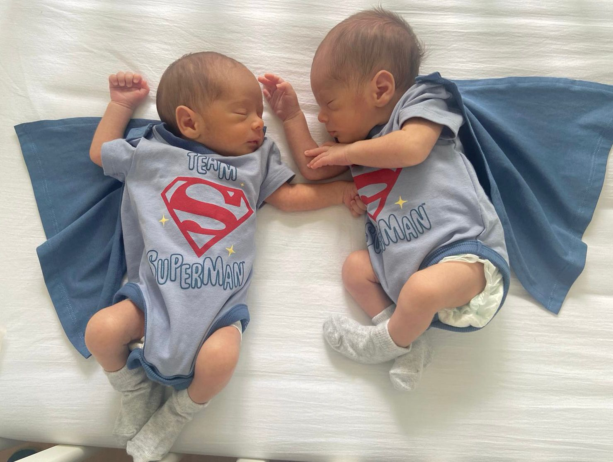

# ¡Hola! Soy Luis 👋

Soy un desarrollador apasionado, entusiasta de la tecnología y orgulloso papá de gemelos 👶👶.  
Me encanta crear aplicaciones web, explorar el mundo DevOps y aprender algo nuevo cada día.

  

---

### 🛠️ Tecnologías y herramientas que uso

#### ☁️ **Cloud & Infraestructura**

#### 🔄 **CI/CD & Automatización**

#### 📊 **Monitoreo & Observabilidad**

#### 💻 **Desarrollo & Herramientas**

---

## 🚀 Mi enfoque en DevOps

### 💡 **Lo que me apasiona:**
- 🎯 **Automatización inteligente** - Transformar procesos manuales en workflows eficientes
- ☁️ **Arquitecturas cloud-native** - Diseñar soluciones escalables desde el día uno
- 🔍 **Observabilidad profunda** - Monitoreo que previene problemas antes de que ocurran
- 🛠️ **Herramientas modernas** - Siempre explorando las mejores tecnologías del momento
- 👥 **Colaboración técnica** - Compartir conocimiento y formar equipos más fuertes

### 🌟 **Experiencia que me define:**
- 🧠 **Visión holística** - Veo el panorama completo, no solo mi área
- 🔄 **Adaptabilidad** - Me siento cómodo tanto en startups ágiles como en empresas establecidas
- 📚 **Crecimiento continuo** - Certificaciones y aprendizaje constante
- 🌍 **Perspectiva global** - Experiencia trabajando con equipos internacionales
- 👨‍👩‍👧‍👦 **Gestión bajo presión** - Los gemelos me han enseñado que no hay crisis que no se pueda resolver 😄

## 🚀 Sobre mí

- 💻 Desarrollador full-stack con experiencia en **Laravel**, **Docker** y herramientas **DevOps**.
- 🌱 Actualmente trabajando en mi sitio personal: [luisbarrado.com](https://luisbarrado.com)
- 🛠️ Me gusta trastear con PHP, JavaScript, Bash y configuraciones de servidores.
- 👨‍👩‍👧‍👦 Amante de la familia — ¡y con doble alegría de gemelos!
- 📍 Resido en España 🇪🇸

---

## 💬 Un poco más personal...

#### 🥰 &nbsp;Me encanta...

🚴‍♂️ &nbsp;Salir con la MTB y disfrutar de la naturaleza  
🌍 &nbsp;Viajar y descubrir nuevos lugares  
🏋️ &nbsp;Practicar CrossFit para mantenerme activo  
🍻 &nbsp;Tomar una buena cerveza con los amigos  
💻 &nbsp;Codear y aprender cosas nuevas cada día  

---

## 🦸‍♂️ Zona Barrado

<samp>
    Azure Hero 🚀  
    Kubernetes  🚀  
    Docker  🐳  
    Grafana (Visualización)
    Monitorizacion (Zabbix)
      
    "No se puede crecer si no estás dispuesto a saltar a la zona del peligro 🔥"
</samp>

---

### ✉️ &nbsp;Contacto

Si quieres ponerte en contacto conmigo, no dudes en escribirme por cualquiera de estos medios:

- 📧 **Correo electrónico**: [ljbarrado@gmail.com](mailto:ljbarrado@gmail.com)
- 💬 **Twitter/X**: [@luisbarrado](https://x.com/doilh)
- 📱 **LinkedIn**: [linkedin.com/in/luisdevops](https://www.linkedin.com/in/luisdevops)
- ☕ **Ko-fi**: [Invítame un café](https://ko-fi.com/luisbarrado)

Estoy encantado de conectar contigo. ¡Hablemos pronto! 😊

---

<samp>
"Para entender algo no debes entenderlo, sino serlo"
</samp>

